# UVM Hands-On Guide for Beginners

**Author**: UVM Base Generator Team  
**Date**: July 28, 2025  
**Purpose**: Complete hands-on guide for UVM beginners with practical examples

## Table of Contents

1. [UVM Philosophy and Core Concepts](#uvm-philosophy-and-core-concepts)
2. [UVM Architecture Overview](#uvm-architecture-overview)
3. [Step-by-Step Hands-On Tutorial](#step-by-step-hands-on-tutorial)
4. [Understanding UVM Components](#understanding-uvm-components)
5. [Transaction-Level Modeling](#transaction-level-modeling)
6. [Sequence and Sequencer Concepts](#sequence-and-sequencer-concepts)
7. [Practical Implementation Examples](#practical-implementation-examples)
8. [Debugging and Troubleshooting](#debugging-and-troubleshooting)
9. [Best Practices Summary](#best-practices-summary)

---

## UVM Philosophy and Core Concepts

### What is UVM?

UVM (Universal Verification Methodology) is a standardized methodology for functional verification of digital designs. It provides a structured approach to build reusable, scalable testbenches.

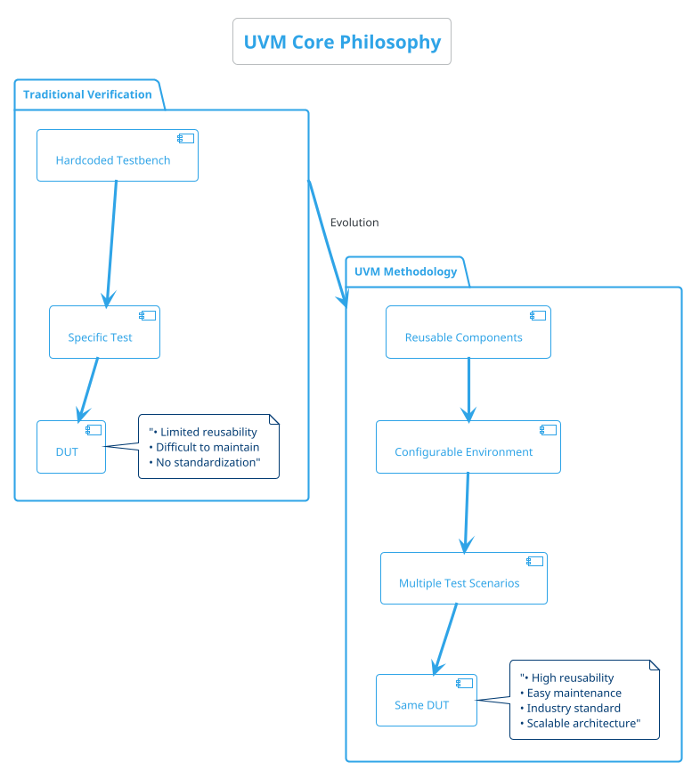

### UVM Key Principles

```plantuml
@startuml uvm_principles
!theme cerulean-outline

title UVM Key Principles

cloud "UVM Principles" as principles {
    rectangle "Reusability" as reuse {
        note top: "Components can be reused\nacross different projects"
    }
    
    rectangle "Modularity" as modular {
        note top: "Each component has\nspecific responsibility"
    }
    
    rectangle "Configurability" as config {
        note top: "Behavior controlled\nthrough configuration"
    }
    
    rectangle "Standardization" as standard {
        note top: "Industry standard\nmethodology and APIs"
    }
    
    rectangle "Scalability" as scale {
        note top: "From simple to complex\nverification environments"
    }
}

reuse -down-> modular
modular -down-> config
config -down-> standard
standard -down-> scale

@enduml
```

### Transaction-Level Modeling Concept

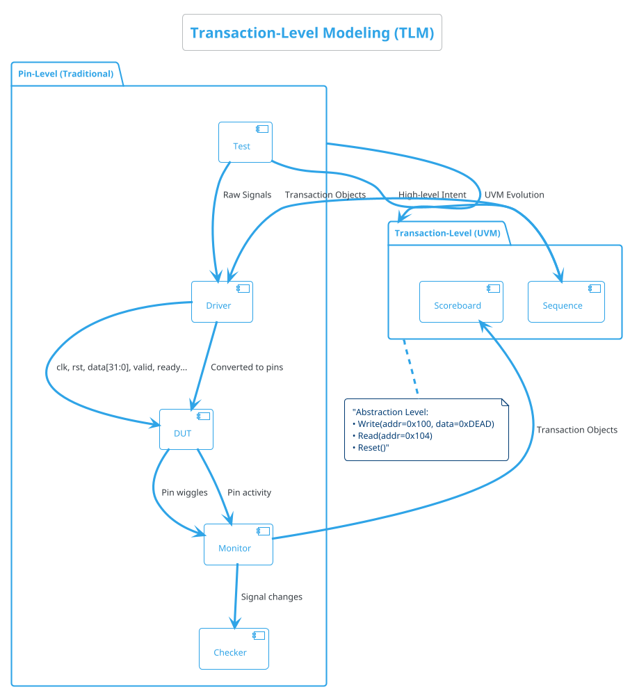

---

## UVM Architecture Overview

### Complete UVM Testbench Architecture

```plantuml
@startuml uvm_architecture
!theme cerulean-outline

title Complete UVM Testbench Architecture

package "UVM Testbench" as tb {
    
    package "Test Layer" as test_layer {
        class "uvm_test" as test {
            +build_phase()
            +run_phase()
        }
        
        class "base_test" as base_test
        class "specific_tests" as spec_tests
        
        test <|-- base_test
        base_test <|-- spec_tests
    }
    
    package "Environment Layer" as env_layer {
        class "uvm_env" as env {
            +build_phase()
            +connect_phase()
        }
        
        class "scoreboard" as sb {
            +write()
            +check()
        }
        
        class "coverage" as cov {
            +sample()
        }
        
        env *-- sb
        env *-- cov
    }
    
    package "Agent Layer" as agent_layer {
        class "uvm_agent" as agent {
            +build_phase()
            +connect_phase()
        }
        
        class "uvm_driver" as driver {
            +run_phase()
            +drive_item()
        }
        
        class "uvm_monitor" as monitor {
            +run_phase()
            +collect_transactions()
        }
        
        class "uvm_sequencer" as sequencer {
            +run_phase()
        }
        
        agent *-- driver
        agent *-- monitor
        agent *-- sequencer
    }
    
    package "Sequence Layer" as seq_layer {
        class "uvm_sequence" as sequence {
            +body()
        }
        
        class "base_sequence" as base_seq
        class "test_sequences" as test_seqs
        
        sequence <|-- base_seq
        base_seq <|-- test_seqs
    }
    
    package "Transaction Layer" as txn_layer {
        class "uvm_sequence_item" as txn {
            +randomize()
            +convert2string()
        }
    }
}

package "DUT Interface" as dut_if {
    interface "SystemVerilog Interface" as sv_if
}

package "Device Under Test" as dut {
    [RTL Module]
}

' Connections
test --> env : creates
env --> agent : creates
sequencer --> sequence : executes
sequence --> txn : generates
driver --> txn : consumes
driver --> sv_if : drives
sv_if --> dut : connects
dut --> sv_if : responds
monitor --> sv_if : observes
monitor --> sb : sends transactions
monitor --> cov : sends transactions

@enduml
```

### UVM Phase Execution Flow

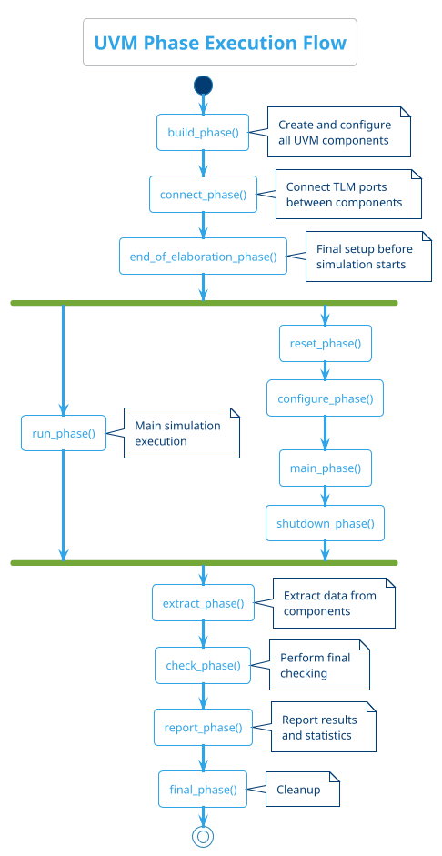

### UVM Factory Pattern

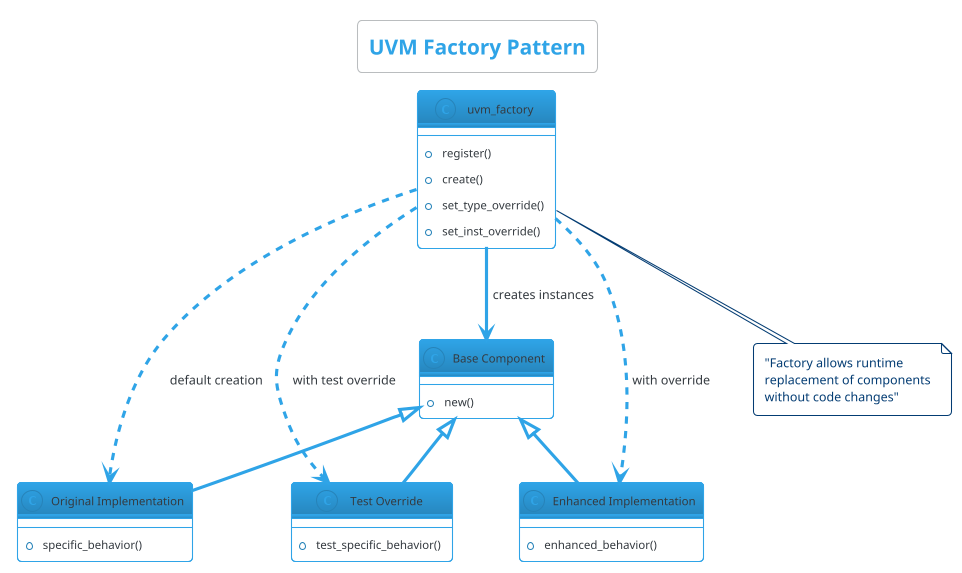

---

## Step-by-Step Hands-On Tutorial

### Step 1: Environment Setup

First, let's verify your environment is ready:

```bash
# Check DSIM installation
dsim --version

# Navigate to project directory
cd /path/to/UVMbasegen

# Verify directory structure
ls -la
```

### Step 2: Understanding the Register File DUT

```plantuml
@startuml register_file_dut
!theme cerulean-outline

title Register File DUT Overview

package "Register File DUT" as dut {
    rectangle "Address Decoder" as addr_dec
    rectangle "Register Array\n[0:3][31:0]" as reg_array
    rectangle "Read/Write Logic" as rw_logic
    
    addr_dec --> reg_array
    reg_array --> rw_logic
}

package "Interface Signals" as signals {
    rectangle "Inputs" as inputs {
        - clk
        - reset
        - address[1:0]
        - write_data[31:0]
        - write_enable
        - read_enable
    }
    
    rectangle "Outputs" as outputs {
        - read_data[31:0]
        - ready
    }
}

inputs --> dut
dut --> outputs

note bottom of dut: "Simple 4-register file\nwith read/write capability"

@enduml
```

### Step 3: Basic UVM Component Creation Flow

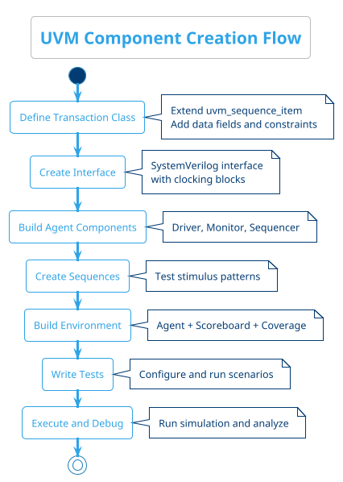

---

## Understanding UVM Components

### Transaction Class Deep Dive

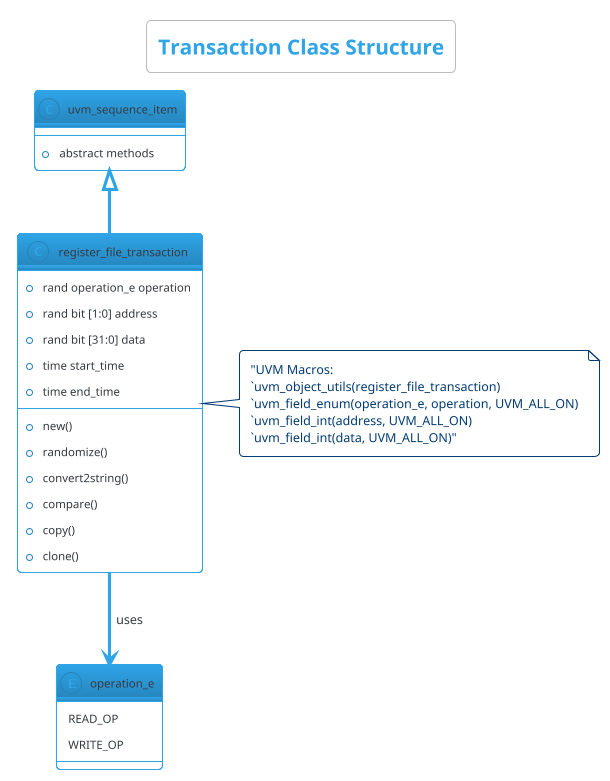

Let's look at the actual implementation:

```systemverilog
class register_file_transaction extends uvm_sequence_item;
    `uvm_object_utils(register_file_transaction)
    
    // Transaction fields
    typedef enum bit {READ_OP, WRITE_OP} operation_e;
    rand operation_e operation;
    rand bit [1:0] address;
    rand bit [31:0] data;
    
    // Timing information
    time start_time;
    time end_time;
    
    // UVM automation macros
    `uvm_field_enum(operation_e, operation, UVM_ALL_ON)
    `uvm_field_int(address, UVM_ALL_ON)
    `uvm_field_int(data, UVM_ALL_ON)
    
    // Constraints
    constraint addr_range_c { address inside {[0:3]}; }
    
    // Constructor
    function new(string name = "register_file_transaction");
        super.new(name);
        start_time = $time;
    endfunction
    
    // Custom methods
    virtual function string convert2string();
        return $sformatf("%s: addr=0x%0h, data=0x%0h", 
                        operation.name(), address, data);
    endfunction
endclass
```

### Driver Component Analysis

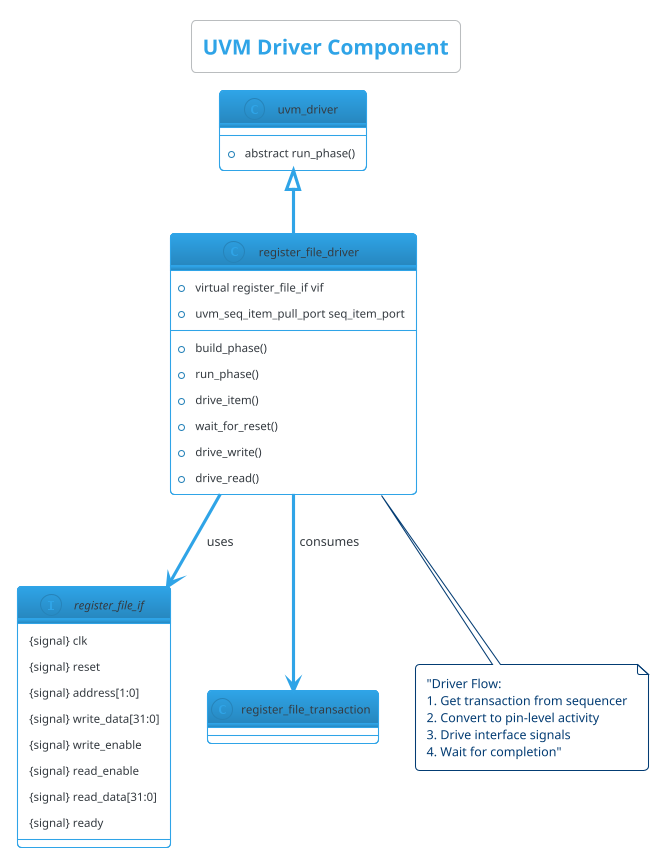

### Monitor Component Analysis

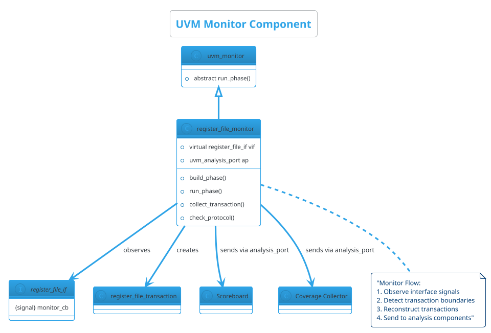

### Sequencer and Agent Relationship

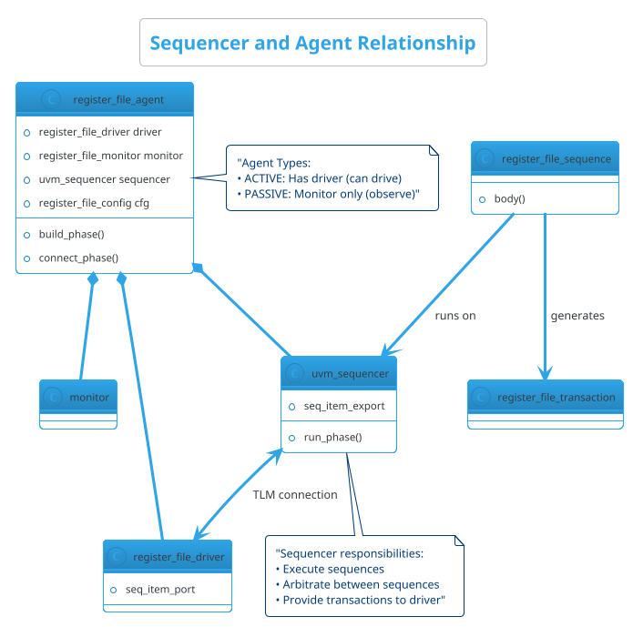

---

## Transaction-Level Modeling

### TLM Communication Flow

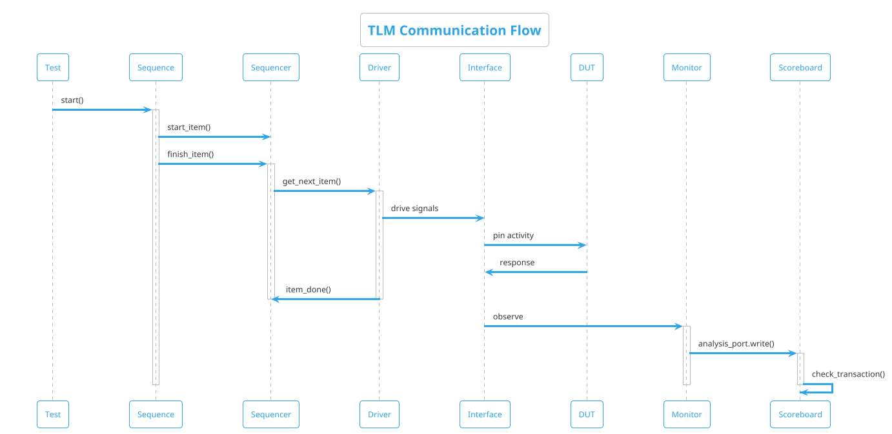

### TLM Ports and Exports

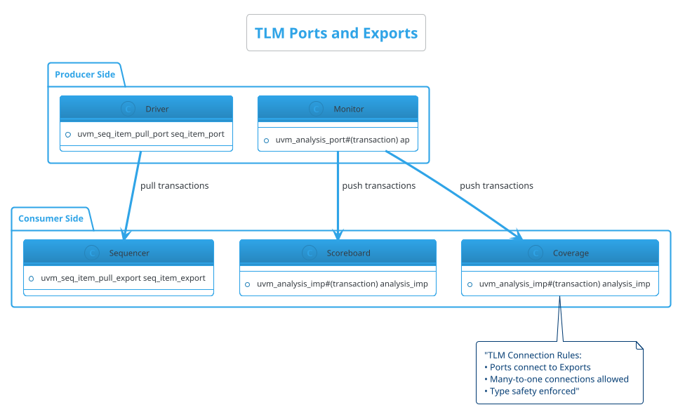

---

## Sequence and Sequencer Concepts

### Sequence Hierarchy

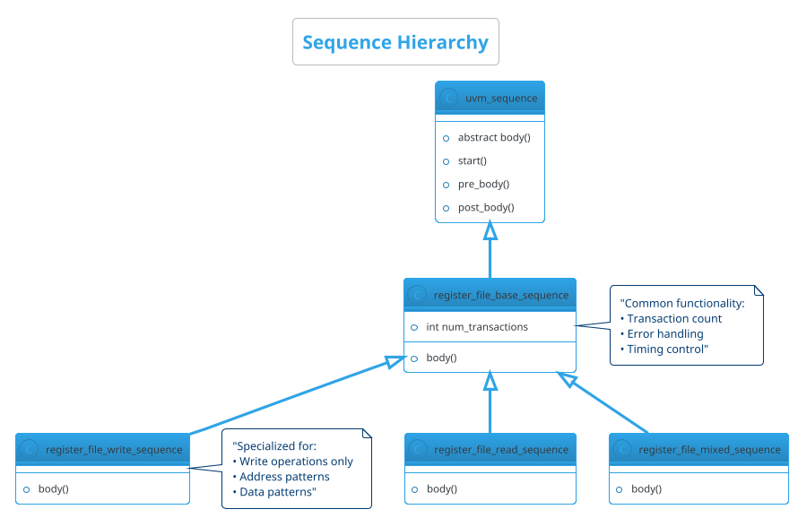

### Sequence Execution Flow

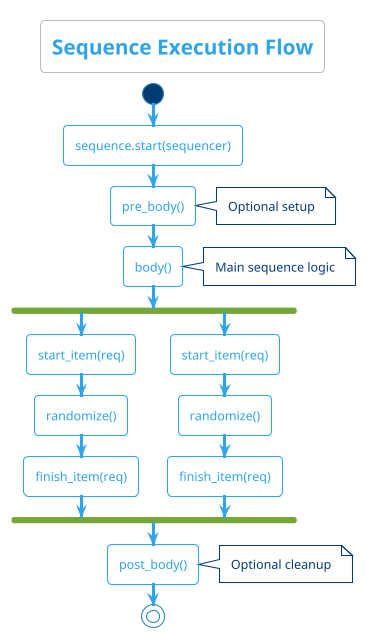

### Practical Sequence Example

```systemverilog
class register_file_write_sequence extends uvm_sequence#(register_file_transaction);
    `uvm_object_utils(register_file_write_sequence)
    
    // Configuration
    rand int num_writes;
    constraint num_writes_c { num_writes inside {[1:10]}; }
    
    virtual task body();
        `uvm_info(get_type_name(), $sformatf("Starting %0d writes", num_writes), UVM_MEDIUM)
        
        repeat (num_writes) begin
            register_file_transaction req = register_file_transaction::type_id::create("write_req");
            
            start_item(req);
            assert(req.randomize() with {
                operation == WRITE_OP;
                address inside {[0:3]};
            });
            finish_item(req);
            
            `uvm_info(get_type_name(), 
                     $sformatf("Write: addr=0x%0h, data=0x%0h", req.address, req.data), 
                     UVM_HIGH)
        end
        
        `uvm_info(get_type_name(), "Write sequence completed", UVM_MEDIUM)
    endtask
endclass
```

---

## Practical Implementation Examples

### Complete Environment Setup

```plantuml
@startuml environment_setup
!theme cerulean-outline

title Environment Setup Flow

start

:Create Transaction Class;
code: register_file_transaction extends uvm_sequence_item

:Create Interface;
code: interface register_file_if

:Build Driver;
code: register_file_driver extends uvm_driver

:Build Monitor;
code: register_file_monitor extends uvm_monitor

:Build Agent;
code: register_file_agent extends uvm_agent

:Create Sequences;
code: register_file_sequence extends uvm_sequence

:Build Scoreboard;
code: register_file_scoreboard extends uvm_scoreboard

:Build Environment;
code: register_file_env extends uvm_env

:Write Tests;
code: register_file_test extends uvm_test

:Execute Simulation;

stop

@enduml
```

### Hands-On Exercise 1: Run Basic Test

Let's start with a simple hands-on exercise:

```bash
# Navigate to simulation directory
cd sim/exec

# Run the basic test
dsim -sv_lib uvm.so +UVM_TESTNAME=register_file_basic_test \
     -compile ../uvm/base/register_file_pkg.sv \
     -compile ../tb/register_file_tb.sv \
     -run

# Expected output:
# UVM_INFO: Running test register_file_basic_test...
# UVM_INFO: *** TEST PASSED ***
```

### Hands-On Exercise 2: Understanding Test Output

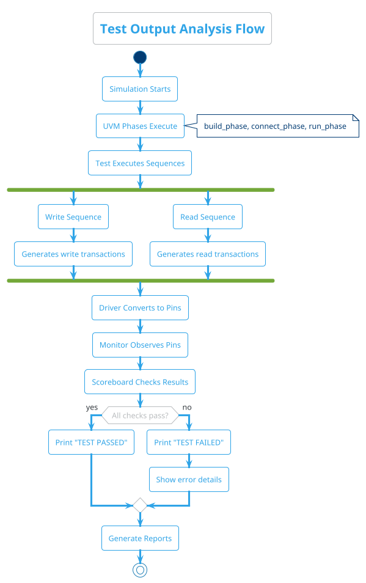

### Hands-On Exercise 3: Modify Test Parameters

Create a custom test configuration:

```systemverilog
class register_file_custom_test extends register_file_basic_test;
    `uvm_component_utils(register_file_custom_test)
    
    function new(string name = "register_file_custom_test", uvm_component parent = null);
        super.new(name, parent);
    endfunction
    
    virtual task run_phase(uvm_phase phase);
        register_file_write_sequence write_seq;
        register_file_read_sequence read_seq;
        
        phase.raise_objection(this);
        
        `uvm_info(get_type_name(), "Starting custom test with more transactions", UVM_LOW)
        
        // Custom write sequence with more transactions
        write_seq = register_file_write_sequence::type_id::create("write_seq");
        write_seq.num_writes = 8;  // Increased from default
        write_seq.start(env.agent.sequencer);
        
        // Custom read sequence
        read_seq = register_file_read_sequence::type_id::create("read_seq");
        read_seq.num_reads = 8;   // Increased from default
        read_seq.start(env.agent.sequencer);
        
        #100us;  // Wait longer
        
        `uvm_info(get_type_name(), "Custom test completed", UVM_LOW)
        
        phase.drop_objection(this);
    endtask
endclass
```

Run the custom test:

```bash
dsim +UVM_TESTNAME=register_file_custom_test -run
```

---

## Debugging and Troubleshooting

### Common UVM Error Patterns

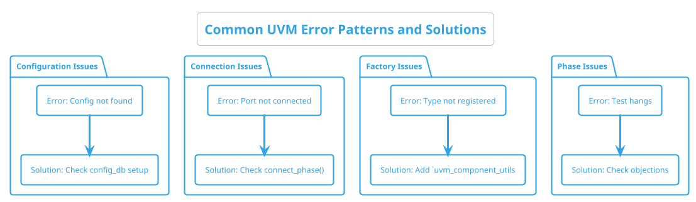

### Debug Information Flow

```plantuml
@startuml debug_flow
!theme cerulean-outline

title Debug Information Flow

start

:Enable UVM Debug;
code: +UVM_VERBOSITY=UVM_HIGH

:Check Phase Execution;
note right: build_phase, connect_phase messages

if (Components created?) then (no)
    :Check factory registration;
    :Verify `uvm_component_utils;
    stop
else (yes)
endif

if (Connections working?) then (no)
    :Check TLM port connections;
    :Verify connect_phase();
    stop
else (yes)
endif

if (Sequences running?) then (no)
    :Check sequencer setup;
    :Verify sequence start();
    stop
else (yes)
endif

if (Test completes?) then (no)
    :Check objection handling;
    :Verify phase.raise_objection();
    :Verify phase.drop_objection();
    stop
else (yes)
endif

:Test runs successfully;

stop

@enduml
```

### Practical Debugging Commands

```bash
# Basic debugging with increased verbosity
dsim +UVM_VERBOSITY=UVM_HIGH +UVM_TESTNAME=register_file_basic_test -run

# Enable specific debug categories
dsim +UVM_VERBOSITY=UVM_MEDIUM +uvm_set_verbosity=*,UVM_HIGH -run

# Debug factory registration
dsim +UVM_VERBOSITY=UVM_HIGH +uvm_set_action=UVM_INFO,UVM_DISPLAY -run

# Enable waveform dumping for signal-level debug
dsim +WAVES +UVM_TESTNAME=register_file_basic_test -run
```

---

## Best Practices Summary

### UVM Coding Best Practices

```plantuml
@startuml best_practices
!theme cerulean-outline

title UVM Best Practices Summary

package "Component Design" as comp_design {
    rectangle "Use UVM Macros" as macros {
        note bottom: "`uvm_component_utils\n`uvm_object_utils\n`uvm_field_int"
    }
    
    rectangle "Proper Phase Usage" as phases {
        note bottom: "build_phase: Create components\nconnect_phase: Connect ports\nrun_phase: Main execution"
    }
    
    rectangle "Configuration" as config {
        note bottom: "Use uvm_config_db\nfor component configuration"
    }
}

package "Sequence Design" as seq_design {
    rectangle "Layered Sequences" as layers {
        note bottom: "Base → Directed → Random\nReusable building blocks"
    }
    
    rectangle "Constraints" as constraints {
        note bottom: "Smart constraints for\nrealistic scenarios"
    }
    
    rectangle "Error Handling" as errors {
        note bottom: "Proper objection handling\nMeaningful error messages"
    }
}

package "Debug Strategy" as debug_strategy {
    rectangle "Incremental Development" as incremental {
        note bottom: "Start simple\nAdd complexity gradually"
    }
    
    rectangle "Verbose Logging" as logging {
        note bottom: "Use UVM_INFO, UVM_WARNING\nControlled verbosity levels"
    }
    
    rectangle "Systematic Testing" as systematic {
        note bottom: "Test each component\nindependently first"
    }
}

@enduml
```

### UVM Learning Path

```plantuml
@startuml learning_path
!theme cerulean-outline

title UVM Learning Path for Beginners

start

:Understand SystemVerilog OOP;
note right: Classes, inheritance,\npolymorphism, interfaces

:Learn UVM Basics;
note right: Phases, factory,\nconfig_db, TLM

:Practice with Simple DUT;
note right: Register file,\nFIFO, counter

:Build Complete Testbench;
note right: All UVM components\nworking together

:Add Advanced Features;
note right: Coverage, constraints,\nadvanced sequences

:Industry Best Practices;
note right: Reusability, scalability,\nmaintainability

stop

@enduml
```

### Project Structure Recommendations

```text
UVMbasegen/
├── rtl/                    # DUT source code
│   ├── hdl/               # Hardware description
│   └── interfaces/        # SystemVerilog interfaces
├── sim/                   # Simulation files
│   ├── uvm/              # UVM verification code
│   │   ├── base/         # Base classes and package
│   │   ├── agents/       # Agent components
│   │   ├── env/          # Environment classes
│   │   ├── tests/        # Test classes
│   │   └── sequences/    # Sequence classes
│   ├── tb/               # Testbench top
│   └── exec/             # Execution directory
├── docs/                 # Documentation
└── scripts/              # Automation scripts
```

---

## Hands-On Checklist

### Before You Start

- [ ] DSIM simulator installed and licensed
- [ ] SystemVerilog knowledge (classes, interfaces)
- [ ] Basic UVM concepts understood
- [ ] Project directory structure ready

### First Steps

- [ ] Run the basic test successfully
- [ ] Understand the output messages
- [ ] Identify UVM components in the code
- [ ] Trace transaction flow through the testbench

### Intermediate Steps

- [ ] Modify sequence parameters
- [ ] Create a custom test
- [ ] Add debug messages
- [ ] Analyze waveforms

### Advanced Steps

- [ ] Create new sequence types
- [ ] Add coverage collection
- [ ] Implement error injection
- [ ] Build reusable components

### Mastery Goals

- [ ] Understand UVM methodology completely
- [ ] Can debug UVM testbenches efficiently
- [ ] Can design scalable verification environments
- [ ] Can apply industry best practices

---

## Conclusion

This hands-on guide provides a comprehensive introduction to UVM methodology with practical examples and exercises. The key to mastering UVM is:

1. **Start Simple**: Begin with basic concepts and gradually add complexity
2. **Practice Regularly**: Hands-on experience is essential
3. **Understand the Philosophy**: UVM is about reusability and scalability
4. **Debug Systematically**: Use the built-in debugging features
5. **Follow Best Practices**: Industry standards ensure maintainable code

Remember: UVM is not just a tool, it's a methodology for building better verification environments. The investment in learning UVM properly will pay dividends in all your future verification projects.

### Next Steps

1. Complete all hands-on exercises in this guide
2. Experiment with different sequence patterns
3. Try building verification for a different DUT
4. Study advanced UVM features (register layer, sequences library)
5. Join the UVM community and contribute to open-source projects

Good luck with your UVM journey!
