# UVM初心者向けハンズオンガイド

**著者**: UVM Base Generator Team  
**日付**: 2025年7月28日  
**目的**: UVM初心者向けの実践的なハンズオンガイド

## 目次

1. [UVMの哲学と基本概念](#uvmの哲学と基本概念)
2. [UVMアーキテクチャ概要](#uvmアーキテクチャ概要)
3. [ステップバイステップハンズオンチュートリアル](#ステップバイステップハンズオンチュートリアル)
4. [UVMコンポーネントの理解](#uvmコンポーネントの理解)
5. [トランザクションレベルモデリング](#トランザクションレベルモデリング)
6. [シーケンスとシーケンサーの概念](#シーケンスとシーケンサーの概念)
7. [実践的な実装例](#実践的な実装例)
8. [デバッグとトラブルシューティング](#デバッグとトラブルシューティング)
9. [ベストプラクティス総括](#ベストプラクティス総括)

---

## UVMの哲学と基本概念

### UVMとは何か？

UVM（Universal Verification Methodology）は、デジタル設計の機能検証のための標準化された方法論です。再利用可能でスケーラブルなテストベンチを構築するための構造化されたアプローチを提供します。

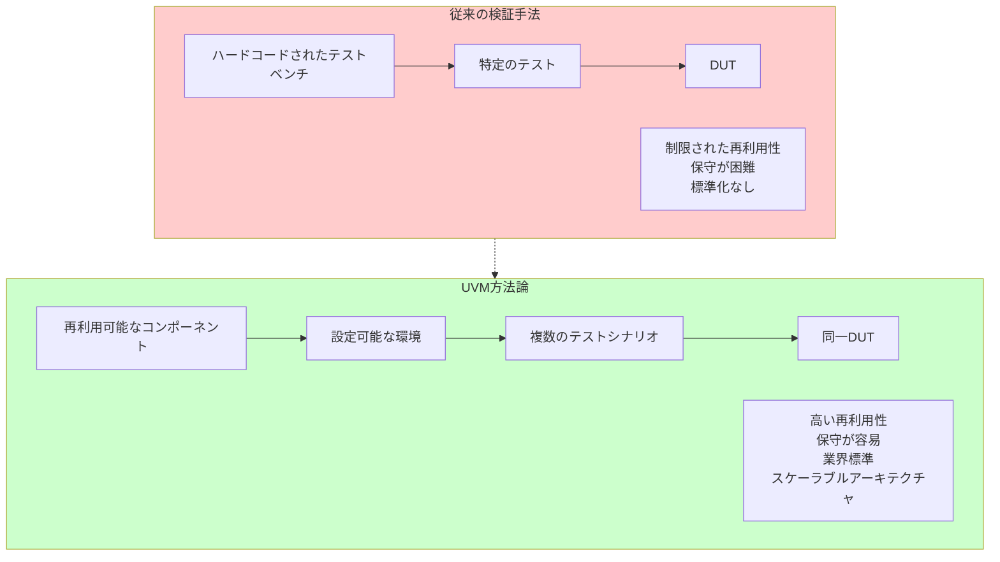

### UVMの主要原則

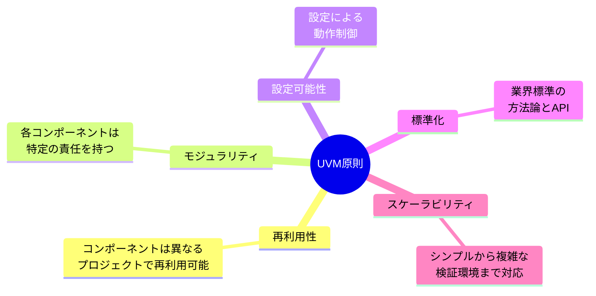

### トランザクションレベルモデリング概念

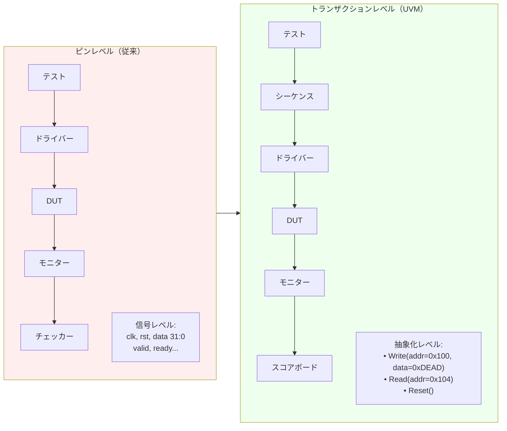

---

## UVMアーキテクチャ概要

### 完全なUVMテストベンチアーキテクチャ

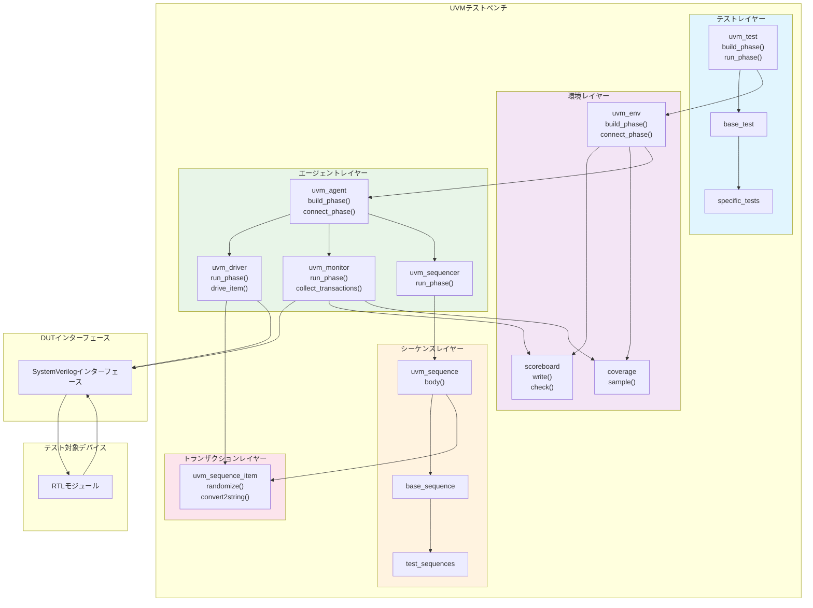

### UVMフェーズ実行フロー

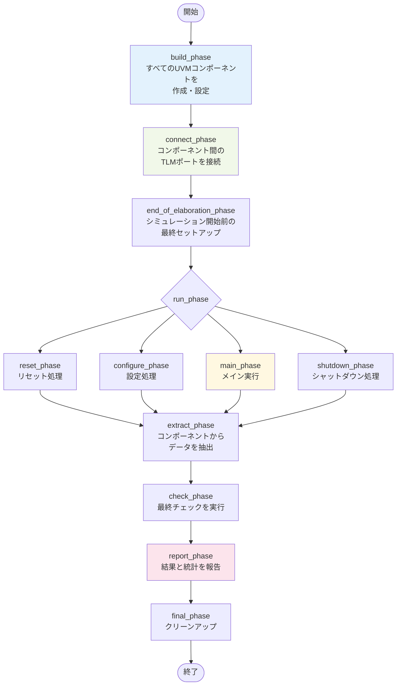

### UVMファクトリーパターン

```mermaid
classDiagram
    class uvm_factory {
        +register()
        +create()
        +set_type_override()
        +set_inst_override()
    }
    
    class Base_Component {
        +new()
    }
    
    class Original_Implementation {
        +specific_behavior()
    }
    
    class Enhanced_Implementation {
        +enhanced_behavior()
    }
    
    class Test_Override {
        +test_specific_behavior()
    }
    
    Base_Component <|-- Original_Implementation
    Base_Component <|-- Enhanced_Implementation
    Base_Component <|-- Test_Override
    
    uvm_factory --> Base_Component : creates instances
    uvm_factory -.-> Original_Implementation : default creation
    uvm_factory -.-> Enhanced_Implementation : with override
    uvm_factory -.-> Test_Override : with test override
    
    note for uvm_factory "ファクトリーは実行時に<br/>コード変更なしで<br/>コンポーネントの置換を可能にする"
```

---

## ステップバイステップハンズオンチュートリアル

### ステップ1: 環境セットアップ

まず、環境が準備できているか確認しましょう：

```powershell
# DSIM インストール確認
dsim --version

# プロジェクトディレクトリに移動
cd E:\Nautilus\workspace\fpgawork\UVMbasegen

# ディレクトリ構造確認
ls
```

### ステップ2: レジスターファイルDUTの理解

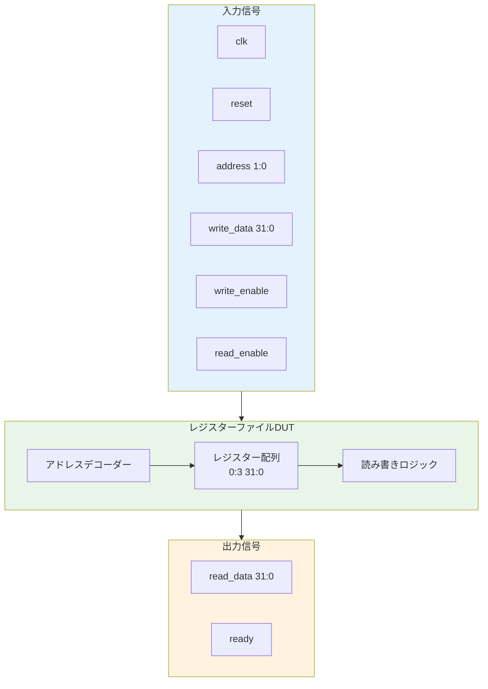

### ステップ3: 基本UVMコンポーネント作成フロー

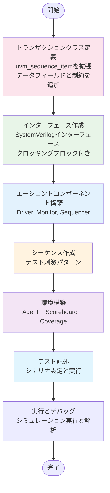

---

## UVMコンポーネントの理解

### トランザクションクラス詳細解析

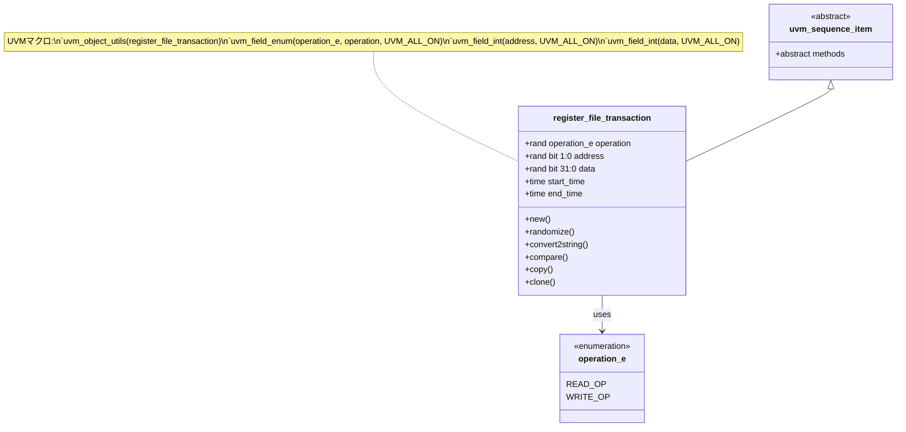

実際の実装を見てみましょう：

```systemverilog
class register_file_transaction extends uvm_sequence_item;
    `uvm_object_utils(register_file_transaction)
    
    // トランザクションフィールド
    typedef enum bit {READ_OP, WRITE_OP} operation_e;
    rand operation_e operation;
    rand bit [1:0] address;
    rand bit [31:0] data;
    
    // タイミング情報
    time start_time;
    time end_time;
    
    // UVM自動化マクロ
    `uvm_field_enum(operation_e, operation, UVM_ALL_ON)
    `uvm_field_int(address, UVM_ALL_ON)
    `uvm_field_int(data, UVM_ALL_ON)
    
    // 制約
    constraint addr_range_c { address inside {[0:3]}; }
    
    // コンストラクタ
    function new(string name = "register_file_transaction");
        super.new(name);
        start_time = $time;
    endfunction
    
    // カスタムメソッド
    virtual function string convert2string();
        return $sformatf("%s: addr=0x%0h, data=0x%0h", 
                        operation.name(), address, data);
    endfunction
endclass
```

### ドライバーコンポーネント解析

```mermaid
graph TB
    subgraph Driver["UVMドライバーコンポーネント"]
        DriverClass["register_file_driver<br/>virtual register_file_if vif<br/>uvm_seq_item_pull_port seq_item_port<br/>build_phase()<br/>run_phase()<br/>drive_item()<br/>wait_for_reset()<br/>drive_write()<br/>drive_read()"]
    end
    
    subgraph BaseDriver["基底クラス"]
        BaseClass["uvm_driver<br/>abstract run_phase()"]
    end
    
    subgraph Interface["インターフェース"]
        VIF["register_file_if<br/>clk, reset<br/>address 1:0<br/>write_data 31:0<br/>write_enable<br/>read_enable<br/>read_data 31:0<br/>ready"]
    end
    
    subgraph Transaction["トランザクション"]
        TxnClass[register_file_transaction]
    end
    
    BaseClass --> DriverClass
    DriverClass --> VIF : uses
    DriverClass --> TxnClass : consumes
    
    note1[ドライバーフロー:<br/>1. シーケンサーからトランザクション取得<br/>2. ピンレベル活動に変換<br/>3. インターフェース信号を駆動<br/>4. 完了まで待機]
    
    style Driver fill:#e8f5e8
    style Interface fill:#e3f2fd
    style Transaction fill:#fce4ec
```

### モニターコンポーネント解析

```mermaid
graph TB
    subgraph Monitor["UVMモニターコンポーネント"]
        MonitorClass["register_file_monitor<br/>virtual register_file_if vif<br/>uvm_analysis_port ap<br/>build_phase()<br/>run_phase()<br/>collect_transaction()<br/>check_protocol()"]
    end
    
    subgraph BaseMonitor["基底クラス"]
        BaseClass["uvm_monitor<br/>abstract run_phase()"]
    end
    
    subgraph Interface["インターフェース"]
        VIF[register_file_if<br/>monitor_cb]
    end
    
    subgraph Transaction["トランザクション"]
        TxnClass[register_file_transaction]
    end
    
    subgraph Analysis["解析コンポーネント"]
        SB[スコアボード]
        Cov[カバレッジコレクター]
    end
    
    BaseClass --> MonitorClass
    MonitorClass --> VIF : observes
    MonitorClass --> TxnClass : creates
    MonitorClass --> SB : sends via analysis_port
    MonitorClass --> Cov : sends via analysis_port
    
    note1[モニターフロー:<br/>1. インターフェース信号を観測<br/>2. トランザクション境界を検出<br/>3. トランザクションを再構築<br/>4. 解析コンポーネントに送信]
    
    style Monitor fill:#f3e5f5
    style Interface fill:#e3f2fd
    style Analysis fill:#fff3e0
```

### シーケンサーとエージェントの関係

```mermaid
graph TB
    subgraph Agent["register_file_agent"]
        AgentClass["register_file_driver driver<br/>register_file_monitor monitor<br/>uvm_sequencer sequencer<br/>register_file_config cfg<br/>build_phase()<br/>connect_phase()"]
        
        Driver["register_file_driver<br/>seq_item_port"]
        Monitor[register_file_monitor]
        Sequencer["uvm_sequencer<br/>seq_item_export<br/>run_phase()"]
        
        AgentClass --> Driver
        AgentClass --> Monitor
        AgentClass --> Sequencer
    end
    
    subgraph Sequence["シーケンス"]
        SeqClass["register_file_sequence<br/>body()"]
    end
    
    subgraph Transaction["トランザクション"]
        TxnClass[register_file_transaction]
    end
    
    Sequencer <--> Driver : TLM connection
    SeqClass --> Sequencer : runs on
    SeqClass --> TxnClass : generates
    
    note1[エージェントタイプ:<br/>• ACTIVE: ドライバー有り（駆動可能）<br/>• PASSIVE: モニターのみ（観測のみ）]
    
    note2[シーケンサーの責任:<br/>• シーケンスを実行<br/>• シーケンス間の調停<br/>• ドライバーにトランザクション提供]
    
    style Agent fill:#e8f5e8
    style Sequence fill:#fff3e0
    style Transaction fill:#fce4ec
```

---

## トランザクションレベルモデリング

### TLM通信フロー

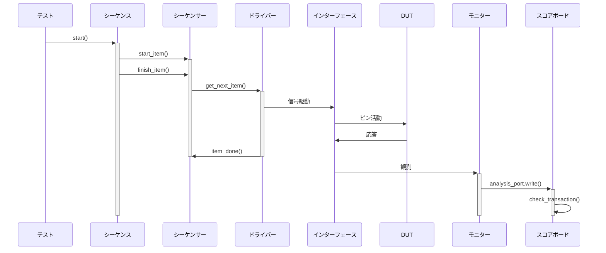

### TLMポートとエクスポート

```mermaid
graph LR
    subgraph Producer["プロデューサー側"]
        Driver["ドライバー<br/>uvm_seq_item_pull_port seq_item_port"]
        Monitor["モニター<br/>uvm_analysis_port#(transaction) ap"]
    end
    
    subgraph Consumer["コンシューマー側"]
        Sequencer["シーケンサー<br/>uvm_seq_item_pull_export seq_item_export"]
        Scoreboard["スコアボード<br/>uvm_analysis_imp#(transaction) analysis_imp"]
        Coverage["カバレッジ<br/>uvm_analysis_imp#(transaction) analysis_imp"]
    end
    
    Driver --> Sequencer : pull transactions
    Monitor --> Scoreboard : push transactions
    Monitor --> Coverage : push transactions
    
    note1[TLM接続ルール:<br/>• ポートはエクスポートに接続<br/>• 多対一接続が可能<br/>• 型安全性が強制される]
    
    style Producer fill:#e8f5e8
    style Consumer fill:#fff3e0
```

---

## シーケンスとシーケンサーの概念

### シーケンス階層

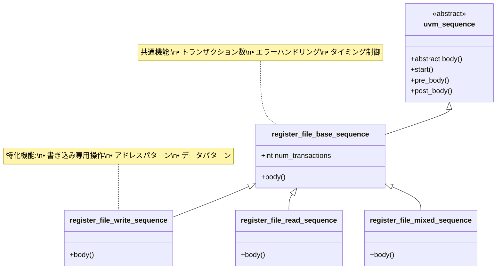

### シーケンス実行フロー

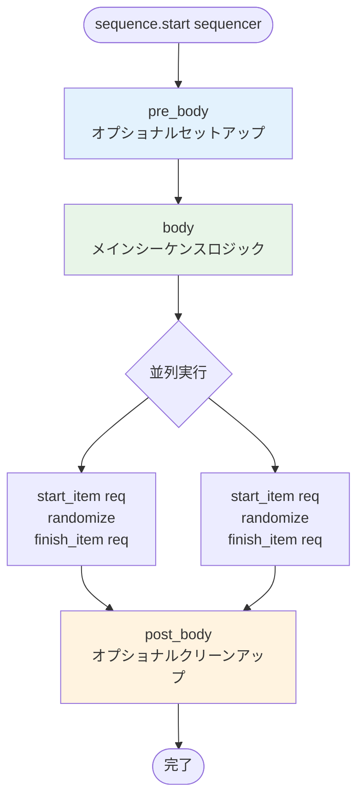

### 実践的なシーケンス例

```systemverilog
class register_file_write_sequence extends uvm_sequence#(register_file_transaction);
    `uvm_object_utils(register_file_write_sequence)
    
    // 設定
    rand int num_writes;
    constraint num_writes_c { num_writes inside {[1:10]}; }
    
    virtual task body();
        `uvm_info(get_type_name(), $sformatf("%0d回の書き込みを開始", num_writes), UVM_MEDIUM)
        
        repeat (num_writes) begin
            register_file_transaction req = register_file_transaction::type_id::create("write_req");
            
            start_item(req);
            assert(req.randomize() with {
                operation == WRITE_OP;
                address inside {[0:3]};
            });
            finish_item(req);
            
            `uvm_info(get_type_name(), 
                     $sformatf("書き込み: addr=0x%0h, data=0x%0h", req.address, req.data), 
                     UVM_HIGH)
        end
        
        `uvm_info(get_type_name(), "書き込みシーケンス完了", UVM_MEDIUM)
    endtask
endclass
```

---

## 実践的な実装例

### 完全な環境セットアップ

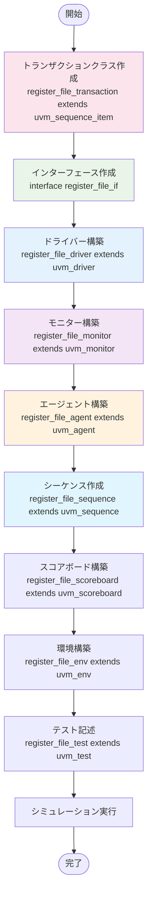

### ハンズオン演習1: 基本テスト実行

簡単なハンズオン演習から始めましょう：

```powershell
# シミュレーションディレクトリに移動
cd sim\exec

# 基本テストを実行
dsim -sv_lib uvm.so +UVM_TESTNAME=register_file_basic_test `
     -compile ..\uvm\base\register_file_pkg.sv `
     -compile ..\tb\register_file_tb.sv `
     -run

# 期待される出力:
# UVM_INFO: Running test register_file_basic_test...
# UVM_INFO: *** TEST PASSED ***
```

### ハンズオン演習2: テスト出力の理解

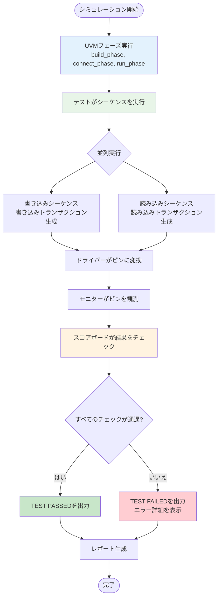

### ハンズオン演習3: テストパラメータの変更

カスタムテスト設定を作成：

```systemverilog
class register_file_custom_test extends register_file_basic_test;
    `uvm_component_utils(register_file_custom_test)
    
    function new(string name = "register_file_custom_test", uvm_component parent = null);
        super.new(name, parent);
    endfunction
    
    virtual task run_phase(uvm_phase phase);
        register_file_write_sequence write_seq;
        register_file_read_sequence read_seq;
        
        phase.raise_objection(this);
        
        `uvm_info(get_type_name(), "より多くのトランザクションでカスタムテストを開始", UVM_LOW)
        
        // より多くのトランザクションでカスタム書き込みシーケンス
        write_seq = register_file_write_sequence::type_id::create("write_seq");
        write_seq.num_writes = 8;  // デフォルトから増加
        write_seq.start(env.agent.sequencer);
        
        // カスタム読み込みシーケンス
        read_seq = register_file_read_sequence::type_id::create("read_seq");
        read_seq.num_reads = 8;   // デフォルトから増加
        read_seq.start(env.agent.sequencer);
        
        #100us;  // より長く待機
        
        `uvm_info(get_type_name(), "カスタムテスト完了", UVM_LOW)
        
        phase.drop_objection(this);
    endtask
endclass
```

カスタムテストを実行：

```powershell
dsim +UVM_TESTNAME=register_file_custom_test -run
```

---

## デバッグとトラブルシューティング

### 一般的なUVMエラーパターン

```mermaid
graph TB
    subgraph ConfigErrors["設定の問題"]
        CE1[エラー: 設定が見つからない]
        CE2[解決策: config_dbセットアップを確認]
        CE1 --> CE2
    end
    
    subgraph ConnErrors["接続の問題"]
        CO1[エラー: ポートが接続されていない]
        CO2[解決策: connect_phase を確認]
        CO1 --> CO2
    end
    
    subgraph FactoryErrors["ファクトリーの問題"]
        FE1[エラー: 型が登録されていない]
        FE2[解決策: `uvm_component_utilsを追加]
        FE1 --> FE2
    end
    
    subgraph PhaseErrors["フェーズの問題"]
        PE1[エラー: テストがハング]
        PE2[解決策: objectionを確認]
        PE1 --> PE2
    end
    
    style ConfigErrors fill:#ffcdd2
    style ConnErrors fill:#fff3e0
    style FactoryErrors fill:#e1f5fe
    style PhaseErrors fill:#f3e5f5
```

### デバッグ情報フロー

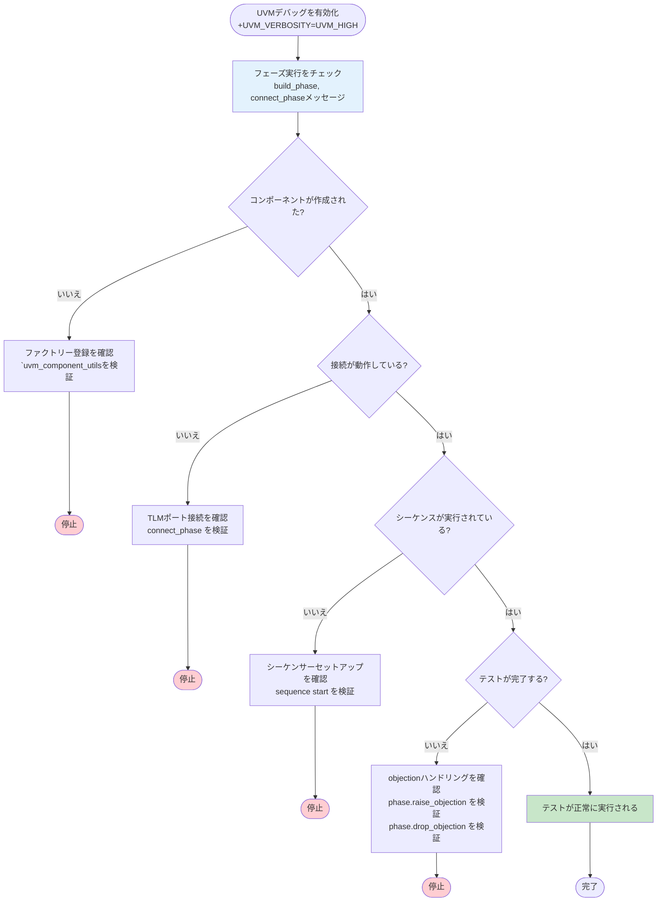

### 実践的なデバッグコマンド

```powershell
# 詳細度を上げた基本デバッグ
dsim +UVM_VERBOSITY=UVM_HIGH +UVM_TESTNAME=register_file_basic_test -run

# 特定のデバッグカテゴリを有効化
dsim +UVM_VERBOSITY=UVM_MEDIUM +uvm_set_verbosity=*,UVM_HIGH -run

# ファクトリー登録をデバッグ
dsim +UVM_VERBOSITY=UVM_HIGH +uvm_set_action=UVM_INFO,UVM_DISPLAY -run

# 信号レベルデバッグのための波形ダンプを有効化
dsim +WAVES +UVM_TESTNAME=register_file_basic_test -run
```

---

## ベストプラクティス総括

### UVMコーディングベストプラクティス

```mermaid
mindmap
  root((UVMベストプラクティス))
    コンポーネント設計
      UVMマクロ使用
        `uvm_component_utils
        `uvm_object_utils
        `uvm_field_int
      適切なフェーズ使用
        build_phase: コンポーネント作成
        connect_phase: ポート接続
        run_phase: メイン実行
      設定
        uvm_config_dbを使用
        コンポーネント設定用
    シーケンス設計
      階層化シーケンス
        Base → Directed → Random
        再利用可能な構成要素
      制約
        現実的なシナリオ用
        スマート制約
      エラーハンドリング
        適切なobjectionハンドリング
        意味のあるエラーメッセージ
    デバッグ戦略
      段階的開発
        シンプルから開始
        段階的に複雑さを追加
      詳細ログ
        UVM_INFO, UVM_WARNING使用
        制御された詳細度レベル
      体系的テスト
        各コンポーネントを
        独立してテスト
```

### UVM学習パス

```mermaid
flowchart TD
    Start([開始]) --> SVOOP[SystemVerilog OOPを理解<br/>クラス、継承、<br/>ポリモーフィズム、インターフェース]
    SVOOP --> UVMBasics[UVM基礎を学習<br/>フェーズ、ファクトリー、<br/>config_db、TLM]
    UVMBasics --> Practice[シンプルなDUTで練習<br/>レジスターファイル、<br/>FIFO、カウンター]
    Practice --> Complete[完全なテストベンチを構築<br/>すべてのUVMコンポーネントが<br/>連携して動作]
    Complete --> Advanced[高度な機能を追加<br/>カバレッジ、制約、<br/>高度なシーケンス]
    Advanced --> Industry[業界ベストプラクティス<br/>再利用性、スケーラビリティ、<br/>保守性]
    Industry --> End([マスター])
    
    style Start fill:#e3f2fd
    style SVOOP fill:#e8f5e8
    style UVMBasics fill:#fff3e0
    style Practice fill:#f3e5f5
    style Complete fill:#e1f5fe
    style Advanced fill:#fce4ec
    style Industry fill:#c8e6c9
    style End fill:#4caf50
```

### プロジェクト構造推奨事項

```
UVMbasegen/
├── rtl/                    # DUTソースコード
│   ├── hdl/               # ハードウェア記述
│   └── interfaces/        # SystemVerilogインターフェース
├── sim/                   # シミュレーションファイル
│   ├── uvm/              # UVM検証コード
│   │   ├── base/         # 基底クラスとパッケージ
│   │   ├── agents/       # エージェントコンポーネント
│   │   ├── env/          # 環境クラス
│   │   ├── tests/        # テストクラス
│   │   └── sequences/    # シーケンスクラス
│   ├── tb/               # テストベンチトップ
│   └── exec/             # 実行ディレクトリ
├── docs/                 # ドキュメント
└── scripts/              # 自動化スクリプト
```

---

## ハンズオンチェックリスト

### 開始前の準備

- [ ] DSIMシミュレーターがインストール・ライセンス済み
- [ ] SystemVerilogの知識（クラス、インターフェース）
- [ ] 基本的なUVM概念の理解
- [ ] プロジェクトディレクトリ構造の準備

### 最初のステップ

- [ ] 基本テストの正常実行
- [ ] 出力メッセージの理解
- [ ] コード内のUVMコンポーネントの識別
- [ ] テストベンチ全体のトランザクションフローの追跡

### 中級ステップ

- [ ] シーケンスパラメータの変更
- [ ] カスタムテストの作成
- [ ] デバッグメッセージの追加
- [ ] 波形の解析

### 上級ステップ

- [ ] 新しいシーケンスタイプの作成
- [ ] カバレッジ収集の追加
- [ ] エラー注入の実装
- [ ] 再利用可能なコンポーネントの構築

### マスタリー目標

- [ ] UVM方法論の完全理解
- [ ] UVMテストベンチの効率的なデバッグ能力
- [ ] スケーラブルな検証環境の設計能力
- [ ] 業界ベストプラクティスの適用能力

---

## まとめ

このハンズオンガイドは、実践的な例と演習を通じてUVM方法論の包括的な入門を提供します。UVMをマスターするための鍵は：

1. **シンプルから始める**: 基本概念から始めて段階的に複雑さを追加
2. **定期的な練習**: ハンズオン経験が不可欠
3. **哲学の理解**: UVMは再利用性とスケーラビリティに関するもの
4. **体系的なデバッグ**: 組み込まれたデバッグ機能を使用
5. **ベストプラクティスの順守**: 業界標準が保守可能なコードを保証

記住してください：UVMは単なるツールではなく、より良い検証環境を構築するための方法論です。UVMを適切に学習することへの投資は、将来のすべての検証プロジェクトで報われるでしょう。

### 次のステップ

1. このガイドのすべてのハンズオン演習を完了
2. 異なるシーケンスパターンで実験
3. 異なるDUTの検証構築に挑戦
4. 高度なUVM機能の学習（レジスターレイヤー、シーケンスライブラリ）
5. UVMコミュニティに参加し、オープンソースプロジェクトに貢献

UVMの旅路での幸運を祈ります！
