# UVM Hands-On Guide for Beginners (Mermaid Edition)

**Author**: UVM Base Generator Team  
**Date**: July 28, 2025  
**Purpose**: Complete hands-on guide for UVM beginners with practical examples using Mermaid diagrams

## Table of Contents

1. [UVM Philosophy and Core Concepts](#uvm-philosophy-and-core-concepts)
2. [UVM Architecture Overview](#uvm-architecture-overview)
3. [Step-by-Step Hands-On Tutorial](#step-by-step-hands-on-tutorial)
4. [Understanding UVM Components](#understanding-uvm-components)
5. [Transaction-Level Modeling](#transaction-level-modeling)
6. [Sequence and Sequencer Concepts](#sequence-and-sequencer-concepts)
7. [Practical Implementation Examples](#practical-implementation-examples)
8. [Debugging and Troubleshooting](#debugging-and-troubleshooting)
9. [Best Practices Summary](#best-practices-summary)

---

## UVM Philosophy and Core Concepts

### What is UVM?

UVM (Universal Verification Methodology) is a standardized methodology for functional verification of digital designs. It provides a structured approach to build reusable, scalable testbenches.

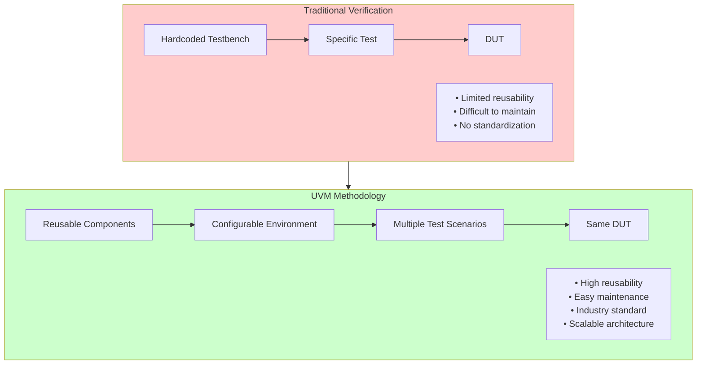

### UVM Key Principles

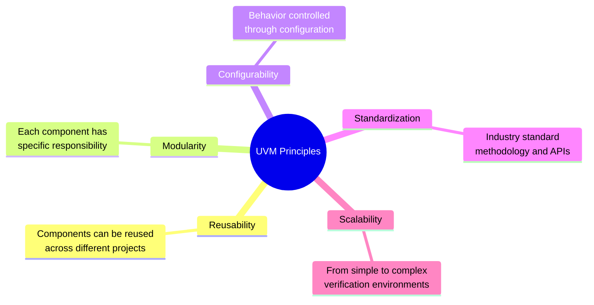

### Transaction-Level Modeling Concept

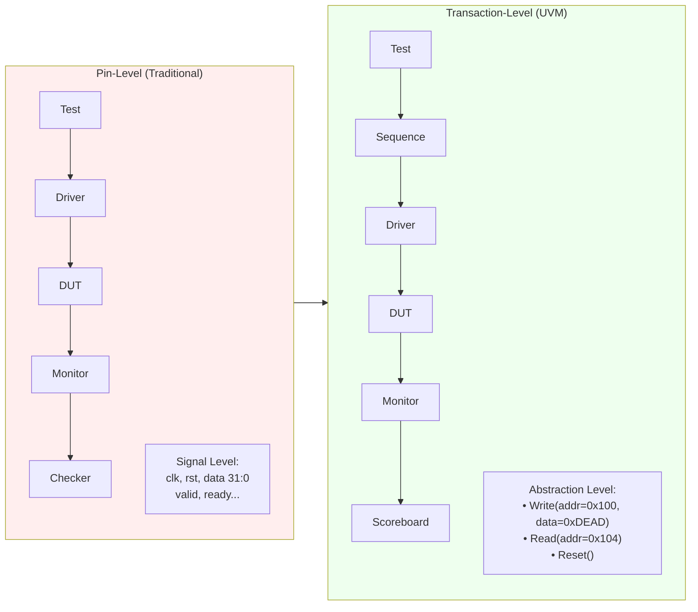

---

## UVM Architecture Overview

### Complete UVM Testbench Architecture

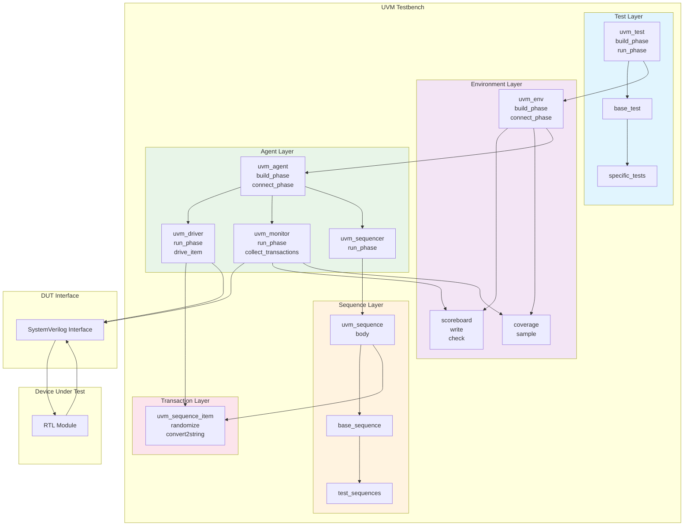

### UVM Phase Execution Flow

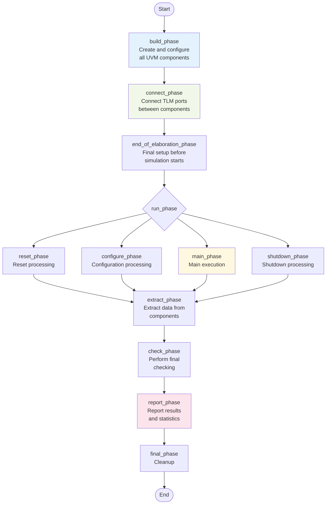

### UVM Factory Pattern

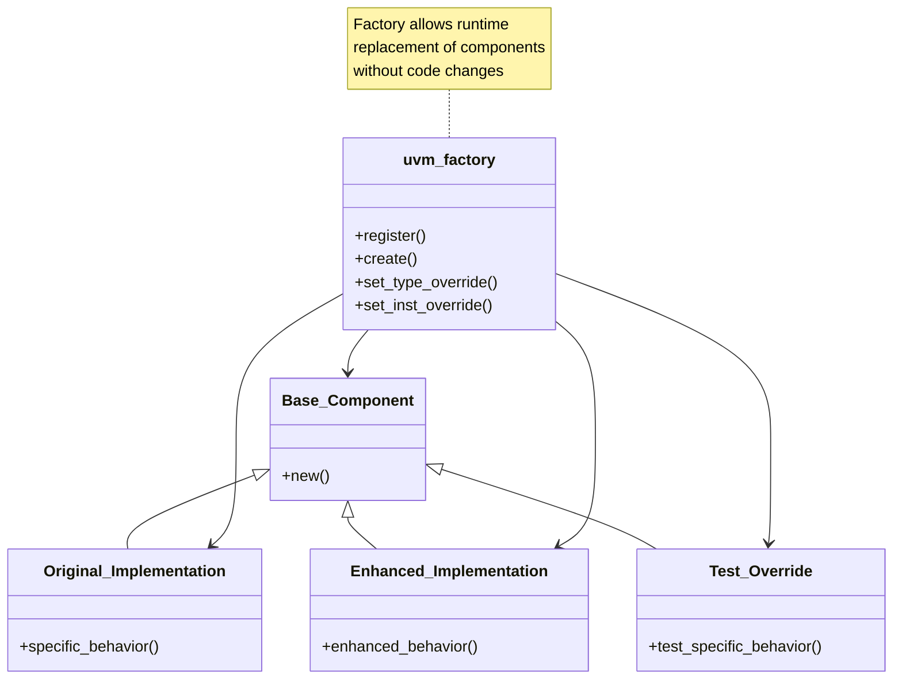

---

## Step-by-Step Hands-On Tutorial

### Step 1: Environment Setup

First, let's verify your environment is ready:

```powershell
# Check DSIM installation
dsim --version

# Navigate to project directory
cd E:\Nautilus\workspace\fpgawork\UVMbasegen

# Verify directory structure
ls
```

### Step 2: Understanding the Register File DUT

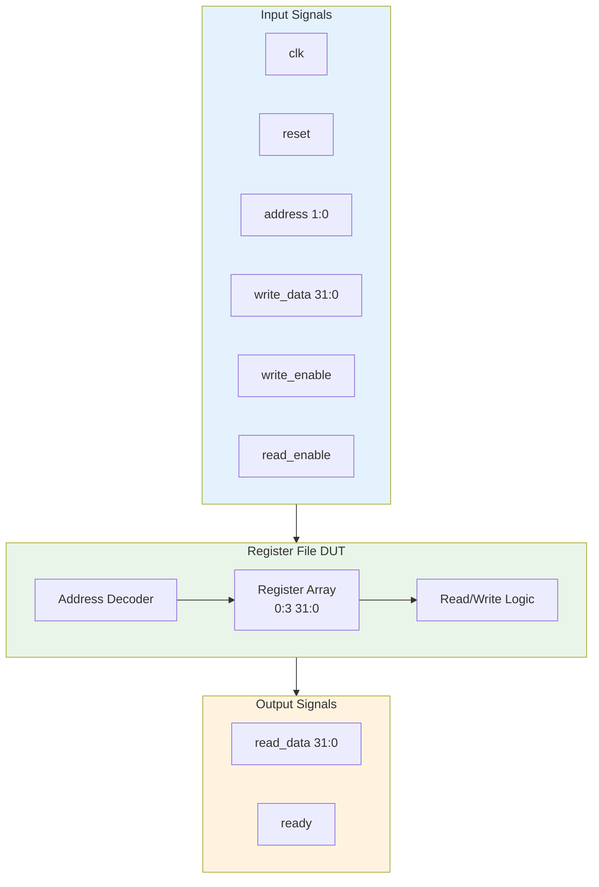

### Step 3: Basic UVM Component Creation Flow

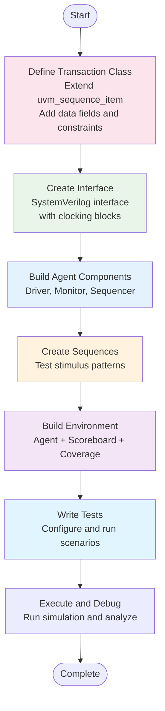

---

## Understanding UVM Components

### Transaction Class Deep Dive

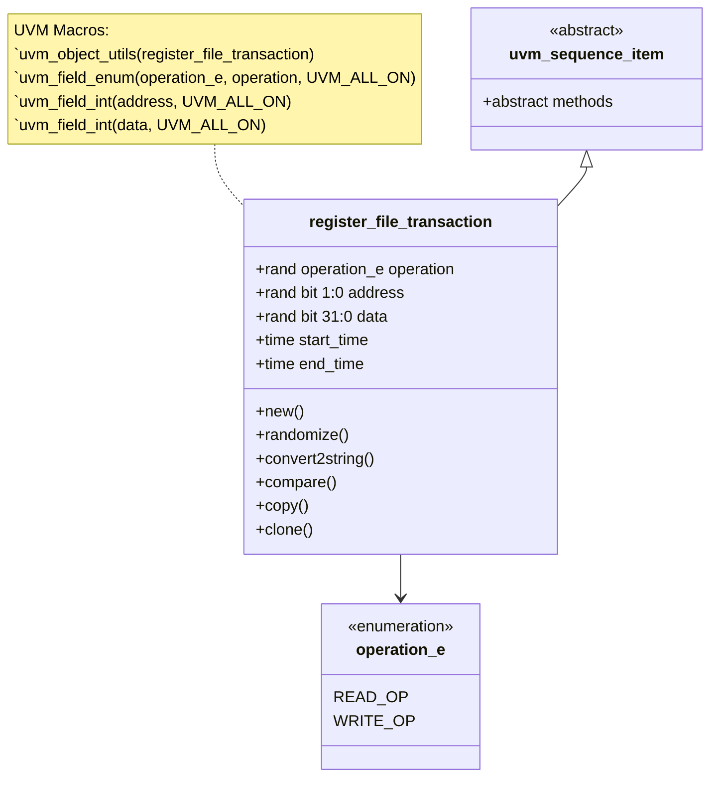

Let's look at the actual implementation:

```systemverilog
class register_file_transaction extends uvm_sequence_item;
    `uvm_object_utils(register_file_transaction)
    
    // Transaction fields
    typedef enum bit {READ_OP, WRITE_OP} operation_e;
    rand operation_e operation;
    rand bit [1:0] address;
    rand bit [31:0] data;
    
    // Timing information
    time start_time;
    time end_time;
    
    // UVM automation macros
    `uvm_field_enum(operation_e, operation, UVM_ALL_ON)
    `uvm_field_int(address, UVM_ALL_ON)
    `uvm_field_int(data, UVM_ALL_ON)
    
    // Constraints
    constraint addr_range_c { address inside {[0:3]}; }
    
    // Constructor
    function new(string name = "register_file_transaction");
        super.new(name);
        start_time = $time;
    endfunction
    
    // Custom methods
    virtual function string convert2string();
        return $sformatf("%s: addr=0x%0h, data=0x%0h", 
                        operation.name(), address, data);
    endfunction
endclass
```

### Driver Component Analysis

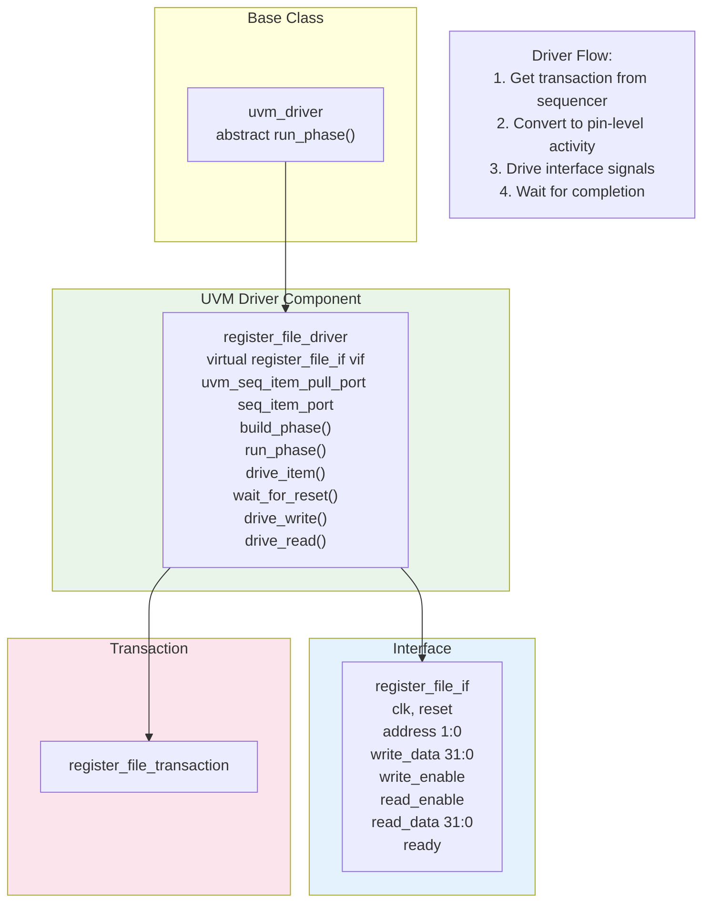

### Monitor Component Analysis

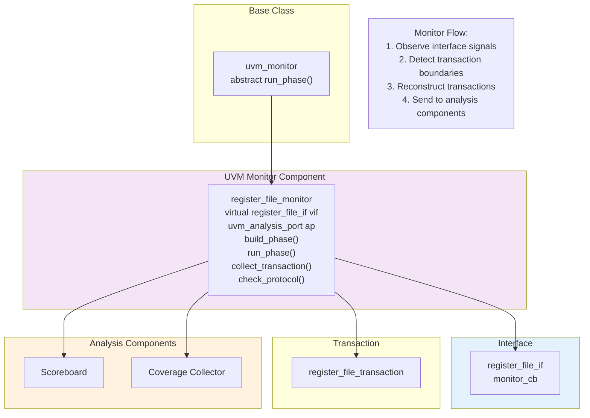

### Sequencer and Agent Relationship

```mermaid
graph TB
    subgraph Agent["register_file_agent"]
        AgentClass["register_file_driver driver<br/>register_file_monitor monitor<br/>uvm_sequencer sequencer<br/>register_file_config cfg<br/>build_phase<br/>connect_phase"]
        
        Driver["register_file_driver<br/>seq_item_port"]
        Monitor[register_file_monitor]
        Sequencer["uvm_sequencer<br/>seq_item_export<br/>run_phase()"]
        
        AgentClass --> Driver
        AgentClass --> Monitor
        AgentClass --> Sequencer
    end
    
    subgraph Sequence["Sequence"]
        SeqClass["register_file_sequence<br/>body()"]
    end
    
    subgraph Transaction["Transaction"]
        TxnClass[register_file_transaction]
    end
    
    Sequencer <--> Driver
    SeqClass --> Sequencer
    SeqClass --> TxnClass
    
    note1[Agent Types:<br/>• ACTIVE: Has driver (can drive)<br/>• PASSIVE: Monitor only (observe)]
    
    note2[Sequencer responsibilities:<br/>• Execute sequences<br/>• Arbitrate between sequences<br/>• Provide transactions to driver]
    
    style Agent fill:#e8f5e8
    style Sequence fill:#fff3e0
    style Transaction fill:#fce4ec
```

---

## Transaction-Level Modeling

### TLM Communication Flow

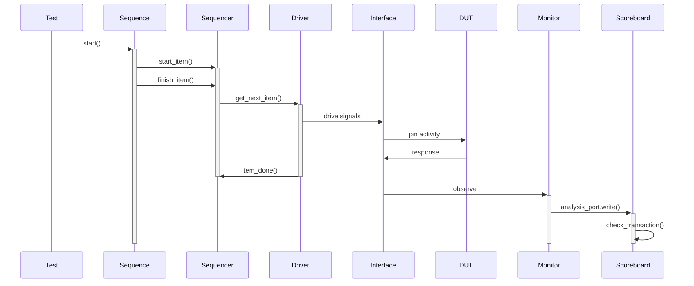

### TLM Ports and Exports

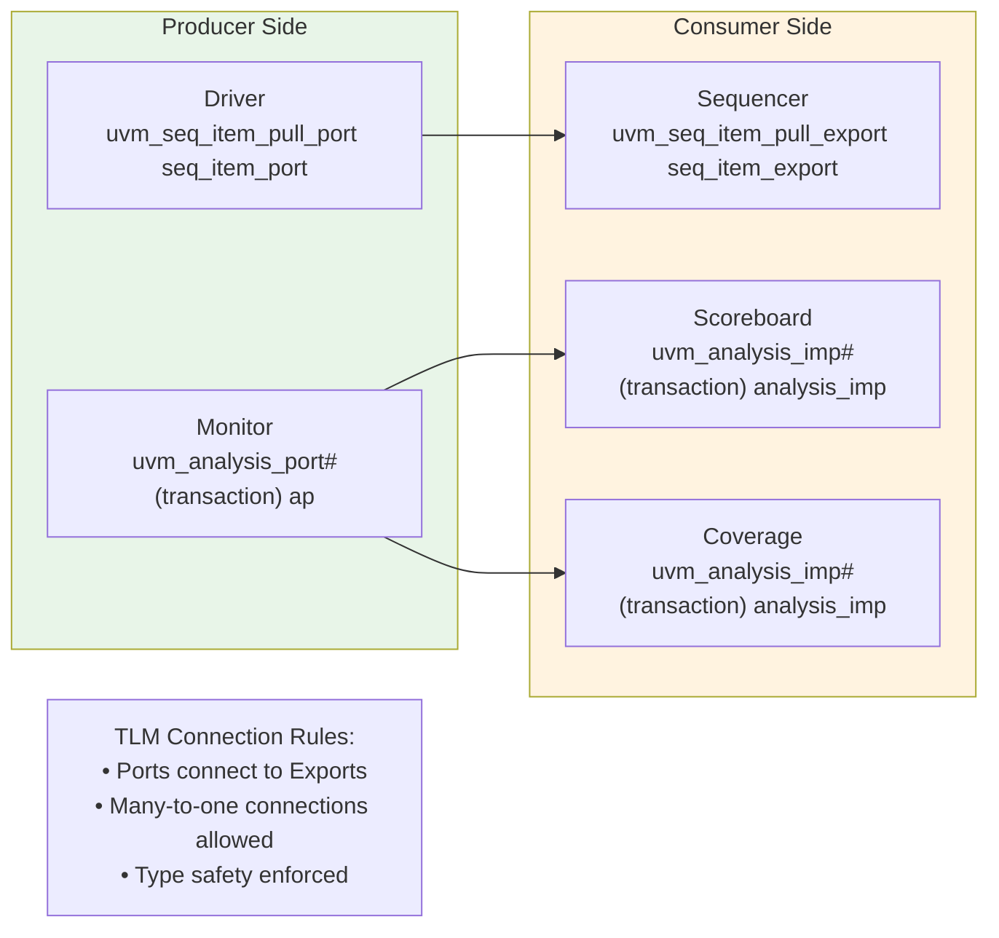

---

## Sequence and Sequencer Concepts

### Sequence Hierarchy

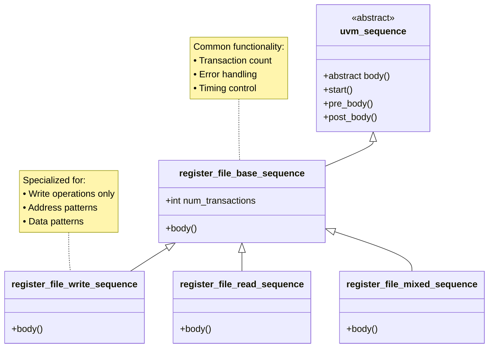

### Sequence Execution Flow

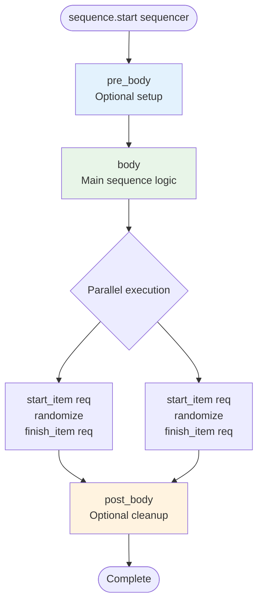

### Practical Sequence Example

```systemverilog
class register_file_write_sequence extends uvm_sequence#(register_file_transaction);
    `uvm_object_utils(register_file_write_sequence)
    
    // Configuration
    rand int num_writes;
    constraint num_writes_c { num_writes inside {[1:10]}; }
    
    virtual task body();
        `uvm_info(get_type_name(), $sformatf("Starting %0d writes", num_writes), UVM_MEDIUM)
        
        repeat (num_writes) begin
            register_file_transaction req = register_file_transaction::type_id::create("write_req");
            
            start_item(req);
            assert(req.randomize() with {
                operation == WRITE_OP;
                address inside {[0:3]};
            });
            finish_item(req);
            
            `uvm_info(get_type_name(), 
                     $sformatf("Write: addr=0x%0h, data=0x%0h", req.address, req.data), 
                     UVM_HIGH)
        end
        
        `uvm_info(get_type_name(), "Write sequence completed", UVM_MEDIUM)
    endtask
endclass
```

---

## Practical Implementation Examples

### Complete Environment Setup

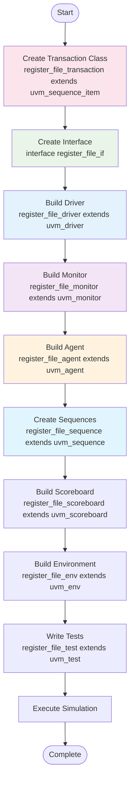

### Hands-On Exercise 1: Run Basic Test

Let's start with a simple hands-on exercise:

```powershell
# Navigate to simulation directory
cd sim\exec

# Run the basic test
dsim -sv_lib uvm.so +UVM_TESTNAME=register_file_basic_test `
     -compile ..\uvm\base\register_file_pkg.sv `
     -compile ..\tb\register_file_tb.sv `
     -run

# Expected output:
# UVM_INFO: Running test register_file_basic_test...
# UVM_INFO: *** TEST PASSED ***
```

### Hands-On Exercise 2: Understanding Test Output

```mermaid
flowchart TD
    Start([Simulation Starts]) --> Phases[UVM Phases Execute<br/>build_phase, connect_phase, run_phase]
    Phases --> TestExec[Test Executes Sequences]
    
    TestExec --> Fork{Parallel execution}
    Fork --> WriteSeq[Write Sequence<br/>Generates write transactions]
    Fork --> ReadSeq[Read Sequence<br/>Generates read transactions]
    
    WriteSeq --> Convert[Driver Converts to Pins]
    ReadSeq --> Convert
    Convert --> Monitor[Monitor Observes Pins]
    Monitor --> Check[Scoreboard Checks Results]
    
    Check --> Pass{All checks pass?}
    Pass -->|Yes| PassMsg[Print "TEST PASSED"]
    Pass -->|No| FailMsg[Print "TEST FAILED"<br/>Show error details]
    
    PassMsg --> Report[Generate Reports]
    FailMsg --> Report
    Report --> End([Complete])
    
    style Phases fill:#e3f2fd
    style TestExec fill:#e8f5e8
    style Check fill:#fff3e0
    style PassMsg fill:#c8e6c9
    style FailMsg fill:#ffcdd2
```

### Hands-On Exercise 3: Modify Test Parameters

Create a custom test configuration:

```systemverilog
class register_file_custom_test extends register_file_basic_test;
    `uvm_component_utils(register_file_custom_test)
    
    function new(string name = "register_file_custom_test", uvm_component parent = null);
        super.new(name, parent);
    endfunction
    
    virtual task run_phase(uvm_phase phase);
        register_file_write_sequence write_seq;
        register_file_read_sequence read_seq;
        
        phase.raise_objection(this);
        
        `uvm_info(get_type_name(), "Starting custom test with more transactions", UVM_LOW)
        
        // Custom write sequence with more transactions
        write_seq = register_file_write_sequence::type_id::create("write_seq");
        write_seq.num_writes = 8;  // Increased from default
        write_seq.start(env.agent.sequencer);
        
        // Custom read sequence
        read_seq = register_file_read_sequence::type_id::create("read_seq");
        read_seq.num_reads = 8;   // Increased from default
        read_seq.start(env.agent.sequencer);
        
        #100us;  // Wait longer
        
        `uvm_info(get_type_name(), "Custom test completed", UVM_LOW)
        
        phase.drop_objection(this);
    endtask
endclass
```

Run the custom test:

```powershell
dsim +UVM_TESTNAME=register_file_custom_test -run
```

---

## Debugging and Troubleshooting

### Common UVM Error Patterns

```mermaid
graph TB
    subgraph ConfigErrors["Configuration Issues"]
        CE1[Error: Config not found]
        CE2[Solution: Check config_db setup]
        CE1 --> CE2
    end
    
    subgraph ConnErrors["Connection Issues"]
        CO1[Error: Port not connected]
        CO2[Solution: Check connect_phase]
        CO1 --> CO2
    end
    
    subgraph FactoryErrors["Factory Issues"]
        FE1[Error: Type not registered]
        FE2[Solution: Add `uvm_component_utils]
        FE1 --> FE2
    end
    
    subgraph PhaseErrors["Phase Issues"]
        PE1[Error: Test hangs]
        PE2[Solution: Check objections]
        PE1 --> PE2
    end
    
    style ConfigErrors fill:#ffcdd2
    style ConnErrors fill:#fff3e0
    style FactoryErrors fill:#e1f5fe
    style PhaseErrors fill:#f3e5f5
```

### Debug Information Flow

```mermaid
flowchart TD
    Start([Enable UVM Debug<br/>+UVM_VERBOSITY=UVM_HIGH]) --> CheckPhase[Check Phase Execution<br/>build_phase, connect_phase messages]
    
    CheckPhase --> CompCreated{Components created?}
    CompCreated -->|No| CheckFactory[Check factory registration<br/>Verify `uvm_component_utils]
    CheckFactory --> Stop1([Stop])
    
    CompCreated -->|Yes| ConnWorking{Connections working?}
    ConnWorking -->|No| CheckTLM[Check TLM port connections<br/>Verify connect_phase]
    CheckTLM --> Stop2([Stop])
    
    ConnWorking -->|Yes| SeqRunning{Sequences running?}
    SeqRunning -->|No| CheckSeq[Check sequencer setup<br/>Verify sequence start()]
    CheckSeq --> Stop3([Stop])
    
    SeqRunning -->|Yes| TestComplete{Test completes?}
    TestComplete -->|No| CheckObj[Check objection handling<br/>Verify phase.raise_objection()<br/>Verify phase.drop_objection()]
    CheckObj --> Stop4([Stop])
    
    TestComplete -->|Yes| Success[Test runs successfully]
    Success --> End([Complete])
    
    style CheckPhase fill:#e3f2fd
    style Success fill:#c8e6c9
    style Stop1 fill:#ffcdd2
    style Stop2 fill:#ffcdd2
    style Stop3 fill:#ffcdd2
    style Stop4 fill:#ffcdd2
```

### Practical Debugging Commands

```powershell
# Basic debugging with increased verbosity
dsim +UVM_VERBOSITY=UVM_HIGH +UVM_TESTNAME=register_file_basic_test -run

# Enable specific debug categories
dsim +UVM_VERBOSITY=UVM_MEDIUM +uvm_set_verbosity=*,UVM_HIGH -run

# Debug factory registration
dsim +UVM_VERBOSITY=UVM_HIGH +uvm_set_action=UVM_INFO,UVM_DISPLAY -run

# Enable waveform dumping for signal-level debug
dsim +WAVES +UVM_TESTNAME=register_file_basic_test -run
```

---

## Best Practices Summary

### UVM Coding Best Practices

```mermaid
mindmap
  root((UVM Best Practices))
    Component Design
      Use UVM Macros
        `uvm_component_utils
        `uvm_object_utils
        `uvm_field_int
      Proper Phase Usage
        build_phase: Create components
        connect_phase: Connect ports
        run_phase: Main execution
      Configuration
        Use uvm_config_db
        for component configuration
    Sequence Design
      Layered Sequences
        Base → Directed → Random
        Reusable building blocks
      Constraints
        Smart constraints for
        realistic scenarios
      Error Handling
        Proper objection handling
        Meaningful error messages
    Debug Strategy
      Incremental Development
        Start simple
        Add complexity gradually
      Verbose Logging
        Use UVM_INFO, UVM_WARNING
        Controlled verbosity levels
      Systematic Testing
        Test each component
        independently first
```

### UVM Learning Path

```mermaid
flowchart TD
    Start([Start]) --> SVOOP[Understand SystemVerilog OOP<br/>Classes, inheritance,<br/>polymorphism, interfaces]
    SVOOP --> UVMBasics[Learn UVM Basics<br/>Phases, factory,<br/>config_db, TLM]
    UVMBasics --> Practice[Practice with Simple DUT<br/>Register file,<br/>FIFO, counter]
    Practice --> Complete[Build Complete Testbench<br/>All UVM components<br/>working together]
    Complete --> Advanced[Add Advanced Features<br/>Coverage, constraints,<br/>advanced sequences]
    Advanced --> Industry[Industry Best Practices<br/>Reusability, scalability,<br/>maintainability]
    Industry --> End([Master])
    
    style Start fill:#e3f2fd
    style SVOOP fill:#e8f5e8
    style UVMBasics fill:#fff3e0
    style Practice fill:#f3e5f5
    style Complete fill:#e1f5fe
    style Advanced fill:#fce4ec
    style Industry fill:#c8e6c9
    style End fill:#4caf50
```

### Project Structure Recommendations

```
UVMbasegen/
├── rtl/                    # DUT source code
│   ├── hdl/              # Hardware description
│   └── interfaces/       # SystemVerilog interfaces
├── sim/                   # Simulation files
│   ├── uvm/             # UVM verification code
│   │   ├── base/        # Base classes and package
│   │   ├── agents/      # Agent components
│   │   ├── env/         # Environment classes
│   │   ├── tests/       # Test classes
│   │   └── sequences/   # Sequence classes
│   ├── tb/              # Testbench top
│   └── exec/            # Execution directory
├── docs/                # Documentation
└── scripts/             # Automation scripts
```

---

## Hands-On Checklist

### Before You Start

- [ ] DSIM simulator installed and licensed
- [ ] SystemVerilog knowledge (classes, interfaces)
- [ ] Basic UVM concepts understood
- [ ] Project directory structure ready

### First Steps

- [ ] Run the basic test successfully
- [ ] Understand the output messages
- [ ] Identify UVM components in the code
- [ ] Trace transaction flow through the testbench

### Intermediate Steps

- [ ] Modify sequence parameters
- [ ] Create a custom test
- [ ] Add debug messages
- [ ] Analyze waveforms

### Advanced Steps

- [ ] Create new sequence types
- [ ] Add coverage collection
- [ ] Implement error injection
- [ ] Build reusable components

### Mastery Goals

- [ ] Understand UVM methodology completely
- [ ] Can debug UVM testbenches efficiently
- [ ] Can design scalable verification environments
- [ ] Can apply industry best practices

---

## Conclusion

This hands-on guide provides a comprehensive introduction to UVM methodology with practical examples and exercises using Mermaid diagrams for enhanced visualization. The key to mastering UVM is:

1. **Start Simple**: Begin with basic concepts and gradually add complexity
2. **Practice Regularly**: Hands-on experience is essential
3. **Understand the Philosophy**: UVM is about reusability and scalability
4. **Debug Systematically**: Use the built-in debugging features
5. **Follow Best Practices**: Industry standards ensure maintainable code

Remember: UVM is not just a tool, it's a methodology for building better verification environments. The investment in learning UVM properly will pay dividends in all your future verification projects.

### Next Steps

1. Complete all hands-on exercises in this guide
2. Experiment with different sequence patterns
3. Try building verification for a different DUT
4. Study advanced UVM features (register layer, sequences library)
5. Join the UVM community and contribute to open-source projects

Good luck with your UVM journey!
